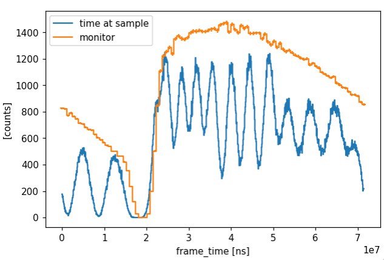
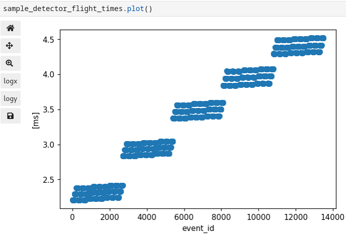
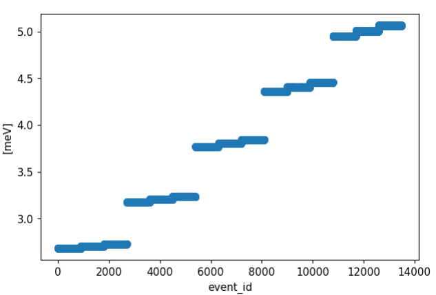
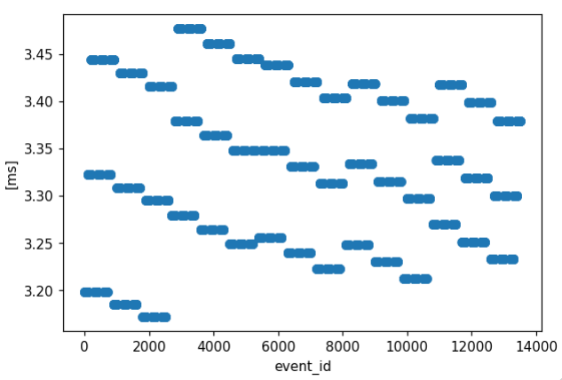
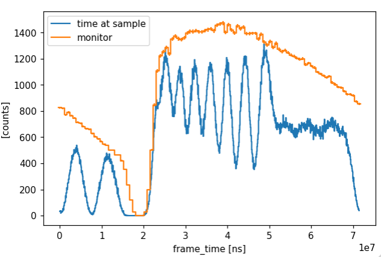
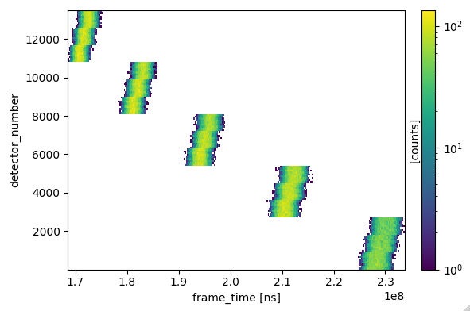

# Issues encountered during workflow development

## Wrong sample-detector flight times
### Description
Comparing the event times when unwrapped and propagated to the sample with the normalization monitor histogram
it appeared that too much time had been removed from the recorded frame-times before unwrapping.

The calculated time of flight from sample to detector had only been checked relative
to an order of magnitude estimate, which was not accurate enough.
A more careful estimate shows that neutrons hitting the central pixel of each central tube in the symmetric
geometry case should take around 3.3 &mu;sec from sample to detector.

### Cause
The sample-to-detector time-of-flight depends on the square root of the energy of the neutron,
which was calculated incorrectly due to a mistake finding the vector from the sample to the detector pixel.

If the sample is at 0, the analyzer at A and the detector at A + D,
then the sample to analyzer vector is A and the analyzer to detector vector is D.
These two vectors were found correctly from the geometry information, but A-D was used incorrectly
for the sample to detector vector.
This then produced the wrong scattering angle, the wrong wavevector magnitude, and the wrong final energy.

### Resolution
Correcting the calculation also corrected the per detector pixel energies

The calculated sample-to-detector time-of-flights are consistent with the limited hand calculated values

And the unwrapped time-at-sample seems more consistent with the monitor histogram.

## Wrong pixel indexing?
### Description
Events from purely elastic scattering appear to slant the wrong way when displayed as in-frame time versus detector
pixel number.
In each block of 2700 pixels, the first and last 900 pixels have the same flight path lengths,
but the first is lower energy and the last higher energy than the central 900.
This should mean that the first 900 pixel's events arrive at a later time-of-flight and later in-frame time
(barring wrap-around at the frame boundary).

Instead, the opposite is shown

### Cause
This could indicate a problem with the read geometry per pixel, but that seems unlikely given
that the final energy per pixel is now correct (see above).
Therefore, the likely culprit lies somewhere in the conversion to pixel indexing from charge division
in the McStas simulation or EFU binary,
or from EFU pixel identifiers to position in the moreniius translation of McStas to NeXus.

### Solution
The charge division was, effectively, reversed by switching the `A` and `B` values used in the McStas simulations.
This seems to have fixed the problem, and highlights the need to systematically verify the meaning of signals
through all stages of the real instrument.
